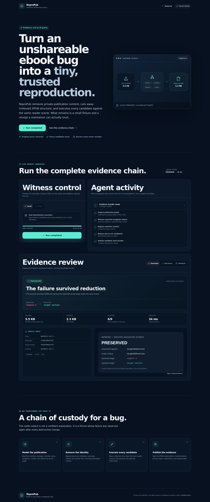
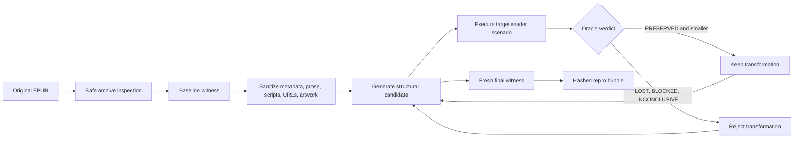

# ReproPub

**Turn a hard-to-share EPUB bug into a small synthetic reproduction, then prove the same failure still occurs.**



Ebook-reader maintainers regularly receive reports whose triggering book is copyrighted, private, too large, or too structurally unusual to share. ReproPub closes that artifact gap. It inspects an EPUB, executes a deterministic scenario, removes sensitive content, reduces the publication one structure-aware transformation at a time, and publishes a verifiable reproduction bundle.

The verdict comes from an executed oracle, not from an AI-written explanation. A candidate is kept only when a fresh witness still observes the reported failure.

## Verified build

The committed sample is a synthetic EPUB with an encoded-fragment navigation bug. A legacy reader looks up `target%20section` literally, fails to find it, and falls back to `chapter-2`; the expected target is `target section`.

| Result | Executed value |
| --- | ---: |
| Verdict | `PRESERVED` |
| Original → reduced | 5,629 → 2,325 bytes |
| Size reduction | 59% |
| Reduction decisions | 6 accepted / 3 rejected |
| Sensitive values | 27 inspected / 0 remaining |
| Hashed bundle artifacts | 7, plus `receipt.json` |
| Core tests | 11 passed |
| Browser verification | Desktop + 390 px mobile, reduced motion |
| Browser console errors | 0 |

The proof files are committed under [`demo/`](demo/). The exact sample receipt is [`demo/sample-bundle/receipt.json`](demo/sample-bundle/receipt.json), and the permanent GitHub Actions workflow rebuilds the product, regenerates the bundle, and repeats the browser journey.

## What it produces

```text
repro-bundle/
├── repro.epub                       # reduced synthetic fixture
├── README.md                        # maintainer-facing reproduction steps
├── receipt.json                     # target, scenario, hashes, verdict, environment, cleanup
├── reduction-log.jsonl              # every accepted and rejected candidate
├── privacy-report.json              # sanitization actions and leakage count
├── observations/navigation.json     # raw oracle input
├── evidence/navigation-witness.svg  # rendered result
└── replay-reference.txt             # local/live recording status
```

Every artifact named in the receipt carries its byte count and SHA-256 digest. `npm run verify:demo` recomputes them and re-inspects the reduced EPUB.

## Run it

Requirements: Node.js 22.12 or newer.

```bash
cd examples/repropub-ts
npm install
npm run check
npm run demo
npm run verify:demo
```

The generated bundle is written to:

```text
.tmp/repropub/demo-bundle/
```

Inspect any EPUB supported by the current parser:

```bash
npm run inspect -- /path/to/book.epub
```

## Review dashboard

Build and start the production dashboard:

```bash
npm run serve
```

Open `http://127.0.0.1:4174`. The dashboard starts the same core pipeline as the CLI and displays actual run state, oracle evidence, reduction decisions, privacy findings, receipt data, and downloadable artifacts.

For development:

```bash
npm run dev
```

The browser smoke journey exercises keyboard activation, the completed desktop view, artifact download, a 390 px mobile viewport, reduced-motion behavior, console errors, and page errors:

```bash
npm run test:browser
```

## How the pipeline works



The current reducer understands publication structure rather than deleting arbitrary bytes. It can remove unused manifest resources, unrelated spine items, navigation entries, prose paragraphs, and associated references while keeping package relationships valid.

## Verdict model

ReproPub has four outcomes:

- `PRESERVED`: the candidate still exhibits the reported failure.
- `LOST`: the candidate now behaves as expected; that transformation is rejected.
- `BLOCKED`: execution could not reach the oracle.
- `INCONCLUSIVE`: execution completed, but the observation does not justify a confident result.

AI may later propose scenarios or reduction candidates. It may not set a verdict. Only an oracle operating on executed observations can do that.

## Local witness and live Solari witness

| Mode | Purpose | Current status |
| --- | --- | --- |
| Local | Deterministic, credential-free product proof and CI | Fully executed and committed |
| Solari | Isolated Sandbox target plus independent recorded Browser witness | Implemented and protocol-tested; not live-executed in this build because no authorized API key was available |

The live path is load-bearing:

1. A Solari Sandbox receives the reduced EPUB, scenario, and a small Python reader harness.
2. The adapter starts that harness with explicit command arguments and exposes port 3000 through a signed preview URL.
3. An independent Solari Browser launches with recording enabled, performs the navigation action, captures the observation and screenshot, closes the session, and downloads the replay.
4. Browser, local client, remote process, and sandbox resources are cleaned up in reverse order, including failure paths.

To run it with an authorized key:

```bash
export SOLARI_API_KEY=slr_live_...
npm run solari-demo
```

The command fails before provisioning when `SOLARI_API_KEY` is absent. Transient transport errors and `502`/`503`/`504` responses are retried within a fixed budget using the same sandbox idempotency key. `429` is surfaced immediately rather than retried.

## Security and privacy boundaries

ReproPub treats every EPUB as hostile input.

The archive layer rejects path traversal, absolute paths, backslashes, NUL bytes, duplicate entries, symbolic links, encrypted ZIPs, unsupported compression methods, multi-disk archives, ZIP64, CRC mismatches, oversized entries, excessive total extraction, and extreme compression ratios.

Sanitization currently replaces or removes:

- title, creator, publisher, identifiers, description, subject, and rights;
- human-readable text nodes while preserving required element structure and IDs;
- script resources, script elements, and inline event handlers;
- remote HTML and CSS URLs;
- SVG cover artwork.

Shareable reports are scanned for Solari key shapes, bearer headers, signed-token query parameters, absolute host paths, original fixture prose, and original metadata. API keys and signed capabilities are never written to receipts.

A reduced fixture lowers sharing risk. It is **not** legal advice or an automatic copyright clearance. The public beta should use synthetic, public-domain, permissively licensed, or explicitly authorized inputs.

## Core interfaces

The product keeps complex behavior behind a small set of public seams:

```text
inspectPublication  → normalize and validate the EPUB graph
sanitizePublication → replace sensitive content and re-witness the failure
reducePublication   → try ordered structural changes and retain only proven ones
runWitness          → execute a scenario and capture raw observations
judgeObservation    → turn observations into one explicit verdict
publishBundle       → write and hash the shareable evidence package
withRunResources    → own reverse-order cleanup across success and failure
```

Tests exercise those seams rather than private helpers.

## API surface

The local production server exposes only the dashboard workflow it needs:

```text
GET  /api/health
GET  /api/runs/latest
POST /api/runs
GET  /api/runs/:id
GET  /api/runs/:id/artifacts/:receipt-listed-path
```

Only one run may execute at a time. Request bodies are limited to 8 KiB. Artifact downloads are limited to files listed in the completed run's receipt, and all requested paths are normalized below the run directory.

## Tests and CI

The intentionally small core suite covers the failures that would invalidate trust in the product:

- wrong-target and corrected-target oracle behavior;
- hostile archive paths and extraction limits;
- sanitization leakage;
- reduction convergence and rejection of bug-fixing candidates;
- deterministic bundle hashes and artifact verification;
- Solari retry, rate-limit, recording, replay, redaction, and cleanup behavior.

Run everything locally:

```bash
npm run check
npm run demo
npm run verify:demo
npm run build
npm run test:browser
```

The repository workflow at [`.github/workflows/repropub.yml`](../../.github/workflows/repropub.yml) runs the same sequence on Node.js 24 and uploads the generated bundle and dashboard screenshots as workflow artifacts.

## Product scope

This first release deliberately supports one objective EPUB 3 navigation failure. It does not yet promise arbitrary visual diagnosis, Android or iOS execution, DRM handling, automatic reader repair, private repository access, PDF/CBZ reduction, legal clearance, hosted accounts, or billing.

The next product-market-fit step is not another broad feature. It is processing authorized real cases with reader maintainers and measuring whether they attach the generated EPUB to an issue, turn it into a regression test, or return with a second case.

## Project records

- [Specification](../../.scratch/repropub/spec.md)
- [Vertical delivery tickets](../../.scratch/repropub/issues/)
- [Domain glossary](../../CONTEXT.md)
- [Research basis](../../docs/repropub/research.md)
- [Architecture decisions](../../docs/adr/)
- [Third-party notices](THIRD_PARTY_NOTICES.md)

ReproPub uses source-style shadcn primitives and adapted interaction patterns from `starc007/ui-components`; attribution and license notes are preserved in `THIRD_PARTY_NOTICES.md`.
